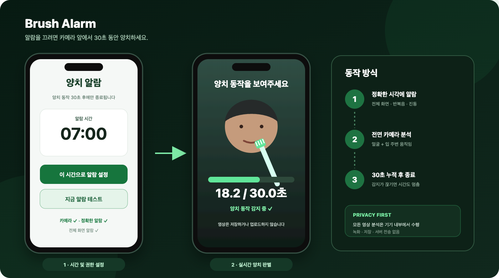

# Brush Alarm

양치 동작이 **30초 동안 감지되어야 멈추는 Android 알람 앱**입니다.

[](https://github.com/JaeoneLim/brush-alarm/actions/workflows/android.yml)
[](https://github.com/JaeoneLim/brush-alarm/releases/latest)
[](LICENSE)

<p align="center">
  
</p>

> 위 이미지는 동작을 설명하기 위한 UI 예시입니다. 글꼴과 시스템 권한 화면은 기기에 따라 달라질 수 있습니다.

## 동작 방식

1. 메인 화면에서 시각과 월~일 반복 요일을 선택하고 **일정 저장 및 적용**을 누릅니다. 요일을 하나도 선택하지 않으면 예약하지 않습니다.
2. 앱은 선택한 요일 중 가장 가까운 미래 시각 하나만 `AlarmClock` 방식의 정확한 알람으로 예약합니다.
3. 알람 수신 시 다음 선택 요일의 정확한 알람을 먼저 예약한 뒤 전체 화면 알람, 반복음, 진동을 시작합니다. 부정확한 반복 알람 API는 사용하지 않습니다.
4. 저비용 밝기 변화 사전 필터를 통과한 프레임만 최대 4 Hz로 ML Kit Face Mesh에 전달합니다.
5. 얼굴 메시의 입 랜드마크로 정규화한 영역에서 국소 움직임을 측정하고, 전체 화면 조명 변화 및 머리/카메라 흔들림을 제외합니다.
6. 짧은 단일 움직임이 아니라 롤링 구간에서 좌우 방향 전환과 현실적인 반복 리듬이 확인되는 동안만 진행 시간을 누적합니다.
7. 누적 시간이 30초에 도달하면 알람을 종료하고 기존 알람 음량을 복원합니다.

**다음 알람 1회 건너뛰기**는 현재 예약된 한 번만 취소하고 그다음 선택 요일로 예약을 교체합니다. 건너뛴 시각과 새 다음 시각은 화면에 표시되며, 이 상태는 재부팅 뒤에도 유지됩니다. 이후 반복은 정상적으로 계속됩니다. **지금 알람 테스트**는 저장된 반복 일정, 건너뛰기 상태, 다음 예약을 변경하지 않지만 실제 알람처럼 양치 완료가 필요합니다.

**알람 화면 미리보기**는 같은 전면 카메라 화면을 소리·진동·음량 강제 없이 보여줍니다. 얼굴 분석이나 30초 양치 타이머를 실행하지 않고, **미리보기 종료** 버튼 또는 뒤로가기로 즉시 닫습니다. 반복 일정 및 다음 알람 예약을 변경하지 않습니다. 카메라 권한이 없다면 화면에서 요청하거나 미리보기를 바로 닫을 수 있습니다.

양치 화면에서는 뒤로가기와 음량 버튼을 차단합니다. 알람이 울리는 동안 시스템 알람 음량을 최대로 유지하며, 외부에서 음량을 낮추더라도 다시 최대로 복구합니다.

## 다운로드 및 설치

최신 APK는 [GitHub Releases](https://github.com/JaeoneLim/brush-alarm/releases/latest)에서 받을 수 있습니다.

- Android 12 이상
- ARM64 Android 기기
- 번들형 ML Kit Face Mesh 모델 사용(베타 API)
- 처음 설치할 때 출처를 알 수 없는 앱 설치 허용 필요

설치 후 앱의 **필수 시스템 권한 확인**을 눌러 다음 항목을 모두 허용하세요.

- 카메라
- 알림
- 정확한 알람
- 전체 화면 알람

시간, 선택 요일, 사용 여부, 다음 예약 및 1회 건너뛴 시각은 앱의 로컬 환경설정에만 저장됩니다. 재부팅, 시간대 변경, 시스템 시각 변경 뒤에는 활성 일정을 현재 로컬 시간 기준으로 다시 예약하며 건너뛴 로컬 날짜는 유지합니다.

## 개인정보 보호

- 카메라 프레임은 기기 안에서만 실시간 분석합니다.
- 영상을 녹화하거나 파일로 저장하지 않습니다.
- 영상 및 분석 데이터를 서버로 전송하지 않습니다.
- 최종 앱 매니페스트에서 `INTERNET` 및 `ACCESS_NETWORK_STATE` 권한을 제거하므로 앱 자체는 네트워크에 접근할 수 없습니다.

## 감지 아키텍처와 한계

- `LumaSignalAnalyzer`가 전체 프레임의 희소 픽셀 변화로 저비용 사전 필터를 수행합니다.
- 무거운 Face Mesh 추론은 `InferenceGate`에서 250 ms 간격(최대 4 Hz)으로 제한하며, 처리 중 들어온 프레임은 버립니다.
- `MlKitFaceMeshProcessor`는 번들형 온디바이스 모델을 비동기로 준비하고, 468개 메시에서 입술 랜드마크와 얼굴 경계 및 눈·코 기반 자세 신호를 순수 Kotlin 신호 계층에 전달합니다.
- `HybridBrushingVerifier`는 입 영역 대비 전체 화면 밝기 변화, 얼굴 중심 이동/크기 변화, 눈(33, 263)과 코(1) 랜드마크 기반 롤·요 변화, 이동 방향 전환 횟수와 주기를 롤링 구간에서 함께 검사합니다.
- 프레임은 다음 프레임과 비교하기 위한 메모리 내 밝기 배열 외에는 보관하지 않으며 녹화, 파일 저장, 업로드를 하지 않습니다.

Face Mesh는 얼굴과 입 주변 움직임을 추적할 뿐 **칫솔이라는 물체 자체를 식별하지 않습니다**. 머리/카메라 이동과 롤·요 변화를 거부하면 흔들기 및 영상 재생 공격을 줄일 수 있지만, 유사한 반복 물체 움직임, 작은 자세 변화의 샘플링 별칭(aliasing), 정교한 영상/화면 재생 같은 스푸핑을 완전히 막을 수 없습니다. 또한 베타 API와 카메라 성능, 조명, 얼굴 가림, 기기 발열에 따라 감지 품질과 전력 사용량이 달라질 수 있습니다. 가까운 셀피 구도와 APK/전력 목표에 맞지 않는 전신 Pose 모델은 사용하지 않습니다.

## Android 제한 사항

일반 Android 앱은 운영체제 수준의 다음 동작까지 막을 수 없습니다.

- 설정에서 강제 종료
- 앱 삭제 또는 권한 철회
- 기기 전원 종료 중에는 알람을 울릴 수 없음(재부팅 완료 뒤 활성 일정은 복구)
- 앱을 강제 종료한 뒤 사용자가 다시 실행하기 전까지는 제조사/Android 정책상 부팅 수신과 알람 동작이 제한될 수 있음
- 제조사별 절전 정책과 고정 음량 기기의 제한

이 저장소의 앱은 일반 개인폰에서 허용되는 범위 안에서 전체 화면 알람, 포그라운드 서비스, 뒤로가기 차단, 음량 버튼 차단 및 최대 알람 음량 유지를 적용합니다.

## 개발

JDK 17과 Android SDK 35가 필요합니다.

```bash
./gradlew testDebugUnitTest verifyNoNetworkPermissions lintDebug lintRelease assembleDebug assembleRelease
```

GitHub Actions:

- `Android CI`: push와 pull request에서 테스트, Lint, debug APK 빌드
- `Publish Android Release`: `v*` 태그에서 테스트 후 서명된 release APK와 SHA-256 체크섬 게시

## 라이선스

[MIT License](LICENSE)
